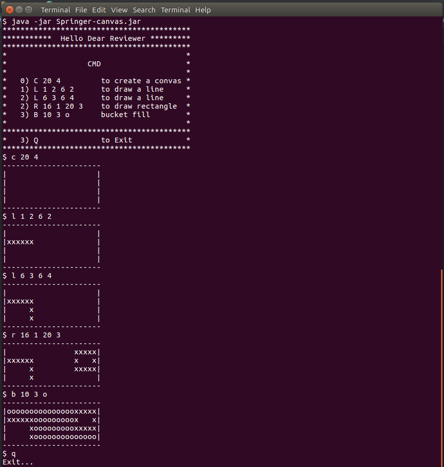
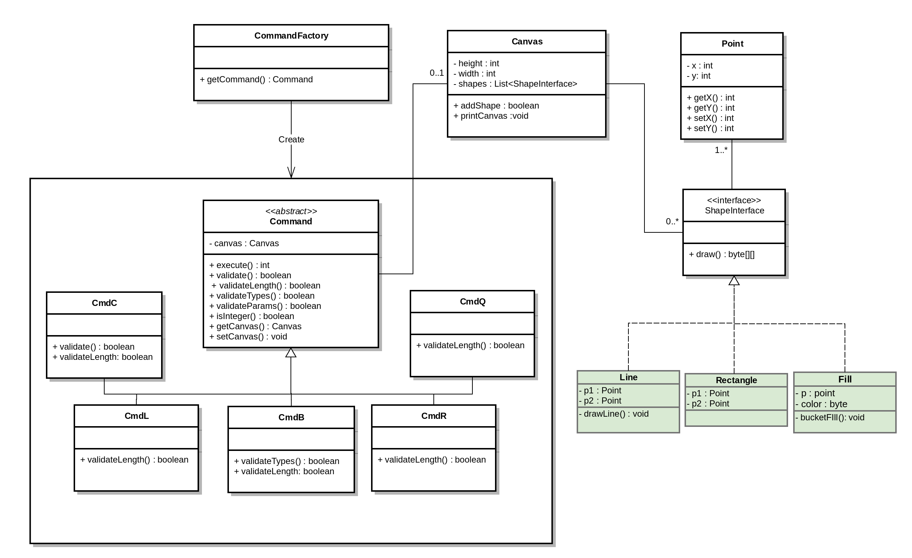

# Canvas-Console
Canvas Console in java

Run the command line in `out/`

`java -jar Springer-canvas.jar`

Build project
------------
Run

`mvn package`

`mvn compile`

Screen Shot
------------

Class Diagram
------------

Design patterns
------------

Factory Design pattern

Dependency injection Design pattern
